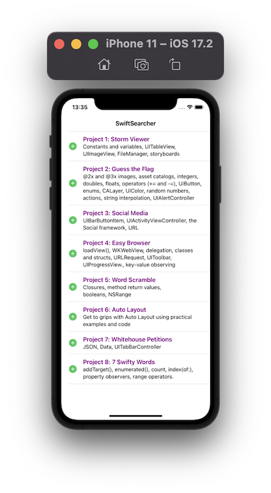
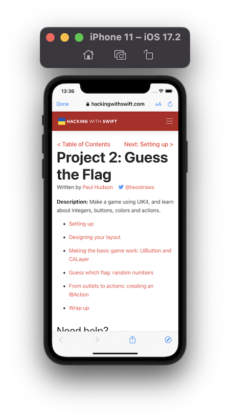
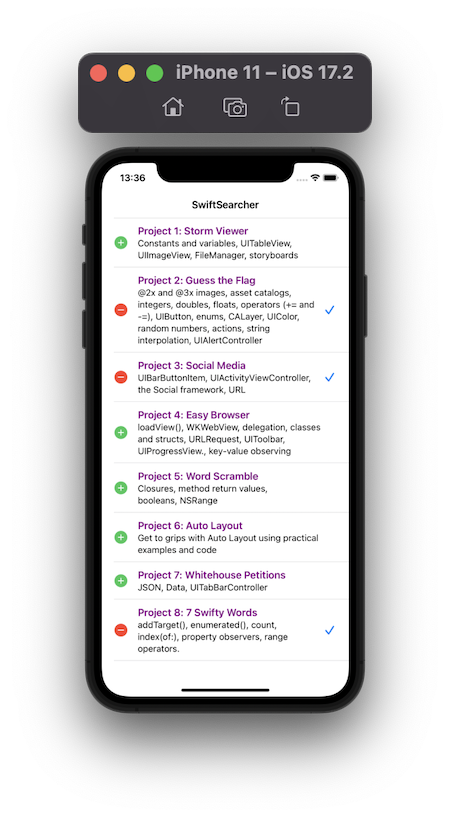
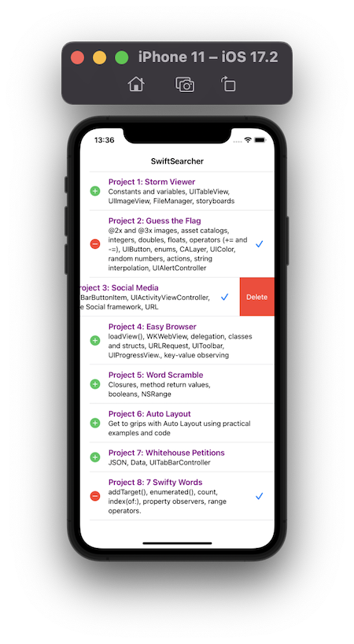
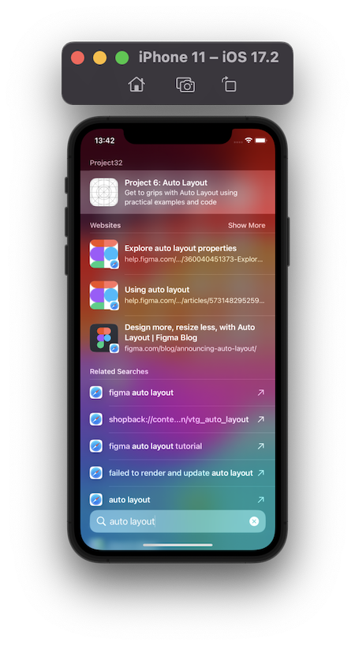
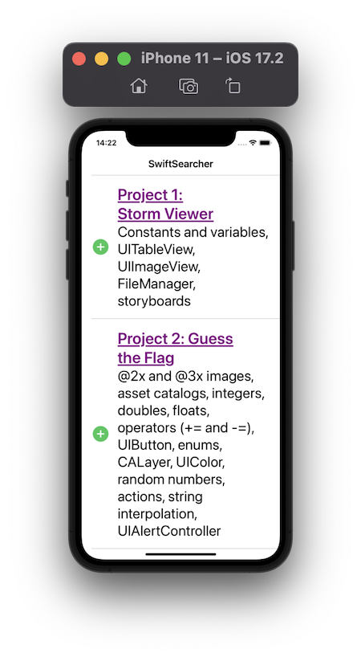

# Project 32 - SwiftSearcher

https://www.hackingwithswift.com/read/32/overview

## Topics
Core Spotlight, SFSafariViewController, NSAttributedString, Dynamic Type, automatic UITableViewCell sizing

## [Challenges](https://www.hackingwithswift.com/read/32/5/wrap-up):
1. If you want to work on this project some more, a great place to start is to convert the projects array to contain objects of a custom subclass rather than just an array. Not only is it safer coding, but it's also more extensible – you might want to add images or other data, and our array stops being so simple when you add more to it! You should follow much the same technique as taught in project 12 to handle loading and saving.

2. I'd also recommend you investigate some of the many other formatting options you can use with NSAttributedString. Right-click on NSAttributedString.Key.font and choose Jump to Definition to see a list, and just try things out! You'll see that Apple has put comments next to each key so you can see what kind of data to provide.

3. There's one more thing, which is the user changing their Dynamic Type size. This won't happen very often, but if it happens while your app is running you'll receive the UIContentSizeCategory.didChangeNotification notification if you subscribe to it using NotificationCenter. This is your chance to refresh your user interface so that it’s drawn at a larger size if needed, but many UIKit components should adapt themselves by default.

## Screenshots

